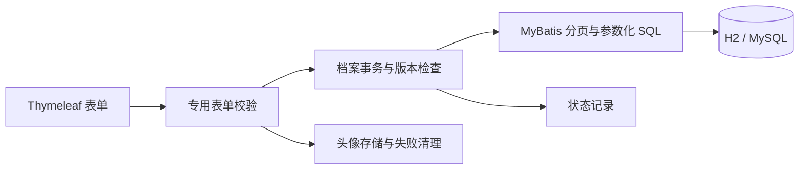
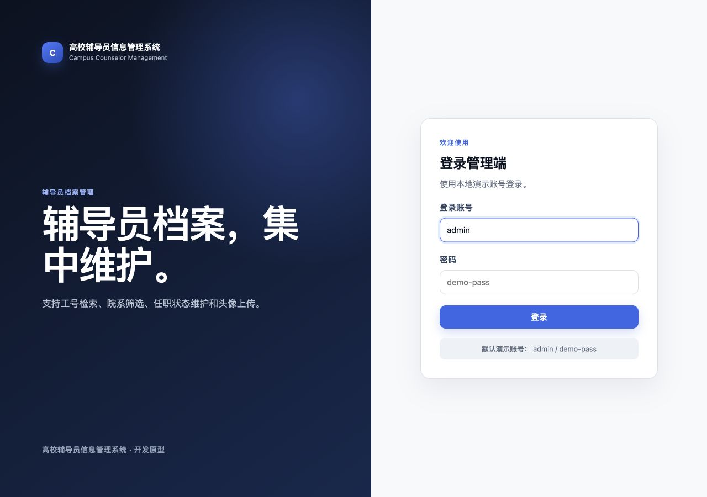

# 高校辅导员信息管理系统

Campus Counselor Management


由 `user-management` 演进而来的辅导员档案管理原型，采用 Java 17、Spring Boot、MyBatis、Thymeleaf 与 Flyway。支持建档、检索、院系维护、状态变更和头像上传。

> 当前完成档案业务阶段。档案与登录账号分开：有档案不代表有登录账号；目前仍使用配置账号和 Session 登录，正式账号、角色授权及 CSRF 防护属于下一阶段。没有真实学校交付或生产运行记录。


## 当前功能

- 工号唯一且统一大写，姓名允许重复；支持院系、在职／停用、备注和头像。
- 按工号或姓名检索，按院系、任职状态筛选；分页、稳定排序及页码越界处理。
- 列表使用一次计数和一次关联分页查询，避免逐条查询院系。
- 新增、编辑、停用档案；保留状态变化、操作者与时间。恢复在职可在编辑页完成。
- 版本号检查：过期编辑和停用请求不能覆盖已保存的修改。
- 院系新增、改名、停用；已被新档案或旧资料引用的院系禁止删除。
- 专用表单对象与字段白名单，数据库主键、照片路径不接受表单直接赋值。
- JPG/PNG 扩展名与 Content-Type 检查、UUID 文件名；保存失败清理新头像，事务提交后才删除被替换的旧头像。
- Flyway 管理表结构；旧资料迁移要求明确工号映射，保留原 ID、姓名、院系、照片路径与旧角色关系。

## 快速运行

要求 JDK 17 或更高版本，无需预装 Maven。仓库和本地目录暂保留 `user-management`。

```bash
git clone https://github.com/GFLabandon/user-management.git
cd user-management
./mvnw spring-boot:run
```

默认启用 `demo` 配置，以内存 H2 加载三条带 `DEMO-` 工号的虚构资料。访问 [本地应用](http://localhost:8080)，账号 `admin`，密码 `demo-pass`。H2 数据随进程退出丢失；持久化验收使用 MySQL。

```bash
./mvnw --batch-mode --no-transfer-progress clean verify
java -jar target/campus-counselor-management-0.1.0-SNAPSHOT.jar
```

## 新 MySQL 数据库

创建空库并为专用账号授予所需权限。当前启动时由 Flyway 执行迁移，账号需要建表、改表、索引及业务读写权限。

```sql
CREATE DATABASE campus_counselor CHARACTER SET utf8mb4 COLLATE utf8mb4_unicode_ci;
```

通过环境变量提供连接信息：

```bash
export SPRING_PROFILES_ACTIVE=mysql
export DB_URL='jdbc:mysql://localhost:3306/campus_counselor?useSSL=false&serverTimezone=Asia/Shanghai&allowPublicKeyRetrieval=true'
export DB_USERNAME='counselor_app'
export DB_PASSWORD='your-local-password'
export UPLOAD_DIR='./uploads'
./mvnw spring-boot:run
```

`mysql` 配置不会加载演示资料；先在“院系管理”新增院系，再建立档案。连接参数没有 root 或默认数据库回退。以上连接参数适用于本机验收，正式环境的连接安全与认证另行配置。项目不自动加载 `.env` 文件，变量说明见 [.env.example](.env.example)。

**已有旧版数据时，不要直接按空库流程运行。** 先备份数据库与上传目录，按[迁移与恢复说明](docs/counselor-migration.md)在副本中演练。自动 baseline 默认关闭；缺少工号映射会停止迁移。旧初始化 SQL 已移到 `docs/legacy/`，不再参与运行时初始化；`DB_INIT_MODE` 已移除。

## 数据与请求链路



`Counselor` 保存业务档案，`Department` 保存院系信息。旧 `users/roles/user_roles` 仅用于迁移核对，应用不再维护旧角色。登录账号尚未存入这些表，未来独立 `SystemAccount` 不会与档案对象混用。

主要入口为 `/counselors` 和 `/departments`，都受登录拦截保护。`/users/list` 保留只读跳转；旧新增、编辑、删除地址已退役。

## 测试与验收

```bash
./mvnw --batch-mode --no-transfer-progress clean verify
```

2026-09-06：26 项自动化测试通过，0 失败、0 错误、0 跳过。覆盖工号唯一与同名、分页与筛选、SQL 查询次数、状态历史、版本冲突、院系引用规则、字段绑定、文件清理、事务回滚和迁移保护。测试数量是当前验证记录，不代表生产质量或性能指标。

另外在独立 MySQL Community Server 9.0.1 实例中验收旧库接管、缺失映射拒绝、映射迁移、备份恢复、业务 HTTP 流程和重启持久化。完整结果见[第二阶段记录](docs/counselor-records-acceptance.md)。CI 使用 JDK 17 执行测试，真实 MySQL 验收为独立本地记录。

## 页面预览

| 登录 | 档案详情 |
| --- | --- |
|  |  |

新截图使用虚构演示资料。原 `directory.*`、`login.*` 是历史阶段截图。

## 项目结构

```text
src/main/java/
├── db/migration/                         # V3 旧资料映射迁移
└── io/github/gflabandon/counselor/
    ├── CounselorManagementApplication.java
    ├── config/                          # Mapper 扫描、路由保护、头像资源
    ├── controller/                      # 登录、档案、院系页面
    ├── entity/                          # Counselor、Department、StatusHistory
    ├── mapper/                          # SQL 与结果映射
    ├── service/                         # 事务、业务规则、图片存储
    └── web/                             # 专用表单和分页结果
src/main/resources/
├── db/migration/                        # 版本化结构迁移
├── db/demo/                             # 仅 demo 配置启用的虚构资料
└── templates/                           # Thymeleaf 页面
src/test/java/                           # 自动化回归测试
docs/legacy/                             # 原版 SQL，供迁移副本与恢复核对
```

## 当前边界

- 配置账号与 Session 属于演示登录；尚无 Spring Security、密码哈希、角色授权或 CSRF 防护。
- 头像读取仍通过 `/uploads/**`，尚无独立访问权限；上传仅检查扩展名及请求类型，未加入图片内容解码、病毒扫描或对象存储。
- 状态记录只记录建档和任职状态变化，不是完整操作审计；院系操作尚无审计记录。
- 文件与数据库不在同一个事务中，当前提供同步失败补偿和清理失败日志，尚无持久化清理队列。
- 没有学生／班级管理、审批、导入导出、AI 功能、生产部署或高并发证据。

下一阶段实现独立账号、正式登录授权和 CSRF，再完善审计及部署。[项目证据](docs/project-evidence.md)区分当前实现、历史记录与待开发能力。
