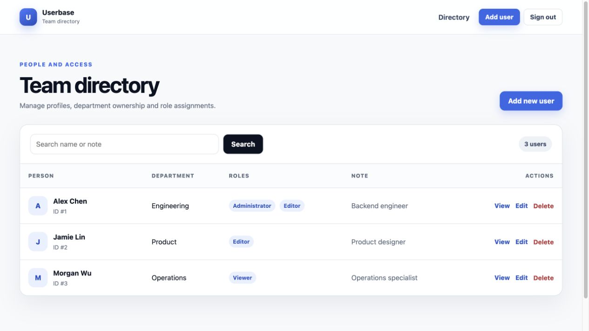
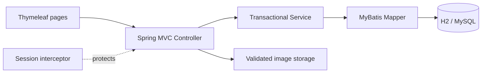
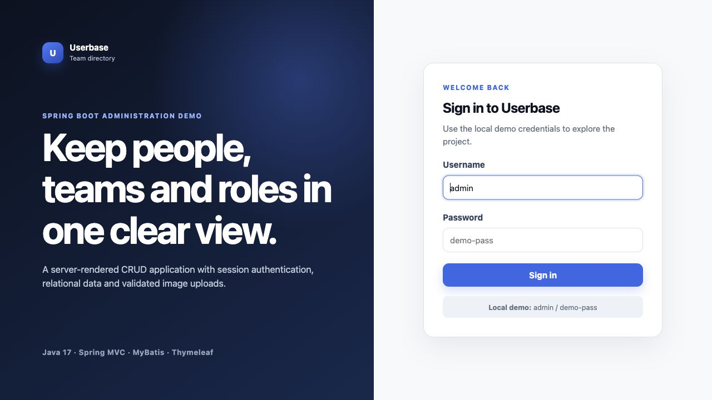

# Userbase · Spring Boot User Management


一个可直接运行的服务端渲染用户管理项目。使用 Spring Boot、Spring MVC、MyBatis 和 Thymeleaf 实现用户 CRUD、条件搜索、部门与角色关系、Session 登录拦截和头像上传；默认使用内存 H2，也可切换 MySQL。

> 这是用于学习和展示 Java Web 分层开发的项目，不是生产级身份认证或完整 RBAC 权限平台。边界见[项目证据与简历口径](docs/project-evidence.md)。



## 功能

- 用户新增、详情、编辑、删除，以及按姓名/备注的大小写无关模糊搜索
- 用户、部门、角色和用户—角色多对多关系建模
- 角色勾选与事务内关系同步
- 基于 Session + MVC Interceptor 的演示登录保护
- 表单 Bean Validation、重复用户名提示和 PRG（Post/Redirect/Get）反馈
- JPG/PNG 白名单、Content-Type 检查、UUID 重命名和独立上传目录
- H2 零配置演示环境，以及通过环境变量连接 MySQL 的独立 profile
- 11 项自动化测试，覆盖应用启动、Web 流程、数据关系、事务更新和文件存储
- 真实 MySQL Community Server 9.0.1 端到端验收记录
- 响应式 Thymeleaf 管理界面

## 架构



请求链路保持清晰：Controller 处理 HTTP 与页面数据，Service 组织事务和角色关系同步，Mapper 负责参数化 SQL 与结果映射。上传文件不进入数据库，数据库只保存 `/uploads/...` 相对路径。

## 快速运行

要求：JDK 17 或更高版本。无需预装 Maven 或 MySQL。

```bash
git clone https://github.com/GFLabandon/user-management.git
cd user-management
./mvnw spring-boot:run
```

访问 [http://localhost:8080](http://localhost:8080)，本地演示账号：

```text
username: admin
password: demo-pass
```

默认数据保存在内存 H2 中，每次重启会恢复三条示例用户数据。账号和密码可通过 `APP_ADMIN_USERNAME`、`APP_ADMIN_PASSWORD` 覆盖。

## 使用 MySQL

先创建空数据库：

```sql
CREATE DATABASE user_management
  CHARACTER SET utf8mb4
  COLLATE utf8mb4_unicode_ci;
```

首次运行时初始化表和示例数据：

```bash
export DB_URL='jdbc:mysql://localhost:3306/user_management?useSSL=false&serverTimezone=Asia/Shanghai&allowPublicKeyRetrieval=true'
export DB_USERNAME='root'
export DB_PASSWORD='your-password'
export DB_INIT_MODE='always'
export SPRING_PROFILES_ACTIVE='mysql'
./mvnw spring-boot:run
```

初始化完成后建议把 `DB_INIT_MODE` 改为 `never`。可复制 [.env.example](.env.example) 查看全部环境变量；项目不会提交真实数据库口令。

## 测试

```bash
./mvnw test
```

当前测试集共 11 项：

- MVC 集成：未登录重定向、登录、列表渲染、用户创建、表单校验
- Service / MyBatis 集成：搜索、部门和角色映射、事务内角色替换
- 文件存储单元测试：UUID 路径、类型拒绝和文件清理
- Spring 应用上下文启动

此外，项目已使用真实 MySQL Community Server 9.0.1 + Connector/J 完成独立验收，覆盖建表/种子数据、登录、带头像与多角色新增、详情、搜索、编辑、事务内角色替换、删除级联和头像清理。验收记录见 [`docs/mysql-acceptance.md`](docs/mysql-acceptance.md)。

GitHub Actions 配置位于 [`.github/workflows/ci.yml`](.github/workflows/ci.yml)，在 push 和 pull request 时使用 JDK 17 执行同一测试命令。

## 项目结构

```text
.
├── .github/workflows/ci.yml
├── docs/
│   ├── images/
│   └── project-evidence.md
├── src/main/java/com/example/usermanagement/
│   ├── config/          # MVC、MyBatis 配置
│   ├── controller/      # 登录与用户页面请求
│   ├── entity/          # User、Department、Role
│   ├── interceptor/     # Session 登录检查
│   ├── mapper/          # MyBatis 注解 SQL 与关系映射
│   └── service/         # 事务业务逻辑与文件存储
├── src/main/resources/
│   ├── db/              # H2 / MySQL 初始化脚本
│   ├── templates/       # Thymeleaf 页面
│   └── static/css/      # 响应式样式
└── src/test/java/       # 11 项自动化测试
```

## 页面预览

| 登录 | 用户目录 |
| --- | --- |
|  |  |

## 安全边界

- 登录账号来自配置，适合本地演示；没有使用 Spring Security、密码哈希、JWT 或数据库账号体系。
- 当前未实现 CSRF 防护；不要把演示登录直接暴露到公网。
- 角色关系目前用于数据建模与页面维护，没有实现接口级角色授权。
- 图片上传会检查扩展名和请求 Content-Type，但没有做文件魔数扫描、病毒扫描或对象存储接入。
- 项目没有生产部署、性能压测、高并发或真实企业用户数据证据。

这些限制是下一阶段可以继续扩展的方向，也避免在简历或面试中把练习项目描述成生产系统。
