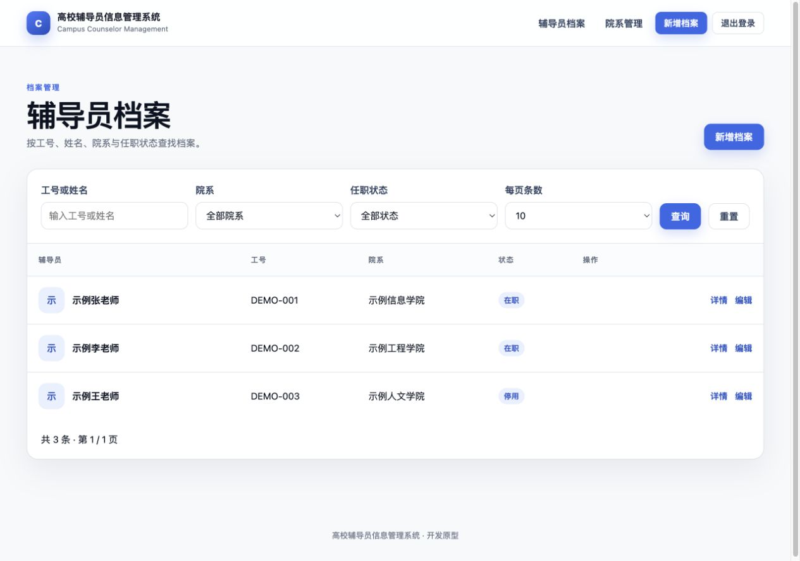
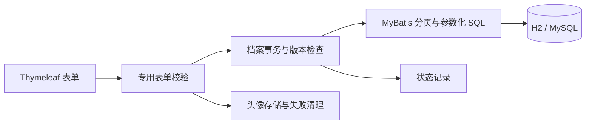
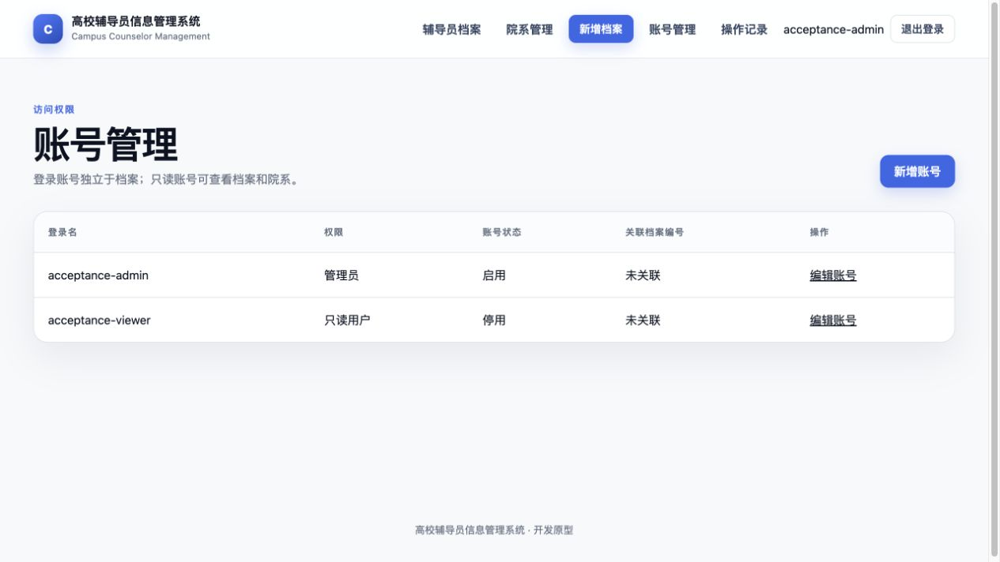
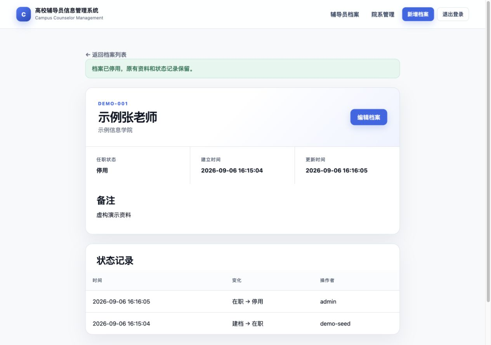

# 高校辅导员信息管理系统

Campus Counselor Management


由 `user-management` 演进而来的辅导员档案管理原型，采用 Java 17、Spring Boot、MyBatis、Thymeleaf 与 Flyway。支持建档、检索、院系维护、状态变更和头像上传。

> 当前完成档案业务及账号权限阶段。档案与登录账号分开，采用 Spring Security 表单登录、管理员／只读授权与 CSRF 防护。仍是本地开发原型，没有真实学校交付或生产运行记录。



## 当前功能

- 工号唯一且统一大写，姓名允许重复；支持院系、在职／停用、备注和头像。
- 按工号或姓名检索，按院系、任职状态筛选；分页、稳定排序及页码越界处理。
- 列表使用一次计数和一次关联分页查询，避免逐条查询院系。
- 新增、编辑、停用档案；保留状态变化、操作者与时间。恢复在职可在编辑页完成。
- 版本号检查：过期编辑和停用请求不能覆盖已保存的修改。
- 院系新增、改名、停用；已被新档案或旧资料引用的院系禁止删除。
- 专用表单对象与字段白名单，数据库主键、照片路径不接受表单直接赋值。
- 独立账号、bcrypt 密码哈希、管理员／只读权限；账号停用或变更后，旧会话在下一次请求失效。
- 登录和写表单保留 CSRF；管理员可维护账号并查看最近 100 条操作记录。
- 头像读取要求登录且被档案引用。上传校验 JPG/PNG 内容、5 MB、2048 像素边长和 400 万总像素，重新编码去除元数据及尾部内容；失败时清理新头像，事务提交后才删除旧头像。
- Flyway 管理表结构；旧资料迁移要求明确工号映射，保留原 ID、姓名、院系、照片路径与旧角色关系。

## 快速运行

要求 JDK 17 或更高版本，无需预装 Maven。仓库和本地目录暂保留 `user-management`。

```bash
git clone https://github.com/GFLabandon/user-management.git
cd user-management
./mvnw spring-boot:run
```

默认启用 `demo` 配置，以内存 H2 加载三条带 `DEMO-` 工号的虚构资料。访问 [本地应用](http://localhost:8080)，管理员 `admin / demo-admin-pass`，只读账号 `viewer / demo-viewer-pass`。H2 数据随进程退出丢失；持久化验收使用 MySQL。

```bash
./mvnw --batch-mode --no-transfer-progress clean verify
java -jar target/campus-counselor-management-0.1.0-SNAPSHOT.jar
```

## 新 MySQL 数据库

创建空库并为专用账号授予所需权限。当前启动时由 Flyway 执行迁移，账号需要建表、改表、索引及业务读写权限。

```sql
CREATE DATABASE campus_counselor CHARACTER SET utf8mb4 COLLATE utf8mb4_unicode_ci;
```

通过环境变量提供连接信息：

```bash
export SPRING_PROFILES_ACTIVE=mysql
export DB_URL='jdbc:mysql://localhost:3306/campus_counselor?useSSL=false&serverTimezone=Asia/Shanghai&allowPublicKeyRetrieval=true'
export DB_USERNAME='counselor_app'
export DB_PASSWORD='your-local-password'
export APP_BOOTSTRAP_USERNAME='your-admin-name'
# 在当前终端安全设置 APP_BOOTSTRAP_PASSWORD，勿将真实密码提交到仓库。
export UPLOAD_DIR='./uploads'
./mvnw spring-boot:run
```

`mysql` 配置不会加载演示资料或演示账号。空账号库首次启动必须提供 `APP_BOOTSTRAP_USERNAME` 和 `APP_BOOTSTRAP_PASSWORD`，密码为 12–64 个字符且 UTF-8 不超过 72 字节，否则启动失败。首次建立管理员后移除初始化凭据，重启不会重设已有密码。先新增院系，再建立档案。连接参数没有 root 或默认数据库回退。以上参数适用于本机验收，正式环境另行配置。项目不自动加载 `.env` 文件，变量说明见 [.env.example](.env.example)。

**已有旧版数据时，不要直接按空库流程运行。** 先备份数据库与上传目录，按[迁移与恢复说明](docs/guides/counselor-migration.md)在副本中演练。自动 baseline 默认关闭；缺少工号映射会停止迁移。旧初始化 SQL 已移到 `docs/legacy/`，不再参与运行时初始化；`DB_INIT_MODE` 已移除。

## 数据与请求链路



`Counselor` 保存业务档案，`Department` 保存院系信息。旧 `users/roles/user_roles` 仅用于迁移核对，不参与授权。`SystemAccount` 独立存入 `system_accounts`，可选择关联一份档案；建档不会自动开通账号。

档案、院系和头像由 Spring Security 统一保护；`/accounts` 与 `/audit` 仅管理员可访问。`/users/list` 保留只读跳转；旧新增、编辑、删除地址已退役。

## 测试与验收

```bash
./mvnw --batch-mode --no-transfer-progress clean verify
```

2026-09-06：37 项自动化测试通过，0 失败、0 错误、0 跳过。覆盖业务、分页 SQL 次数、事务回滚、迁移、文件清理，以及数据库账号、CSRF、权限拒绝、旧会话撤销、私有头像和内容解码。测试数量是当前验证记录，不代表生产质量或性能指标。

独立 MySQL 9.0.1 的历史迁移与恢复结果见[第二阶段记录](docs/acceptance/phase-2-counselor-records.md)。本阶段另验证 V3→V4、空库无凭据拒绝启动，以及真实登录／multipart 上传／权限流程，见[第三阶段记录](docs/acceptance/phase-3-account-security.md)。CI 使用 JDK 17 执行测试，真实 MySQL 验收为独立本地记录。

## 页面预览

| 账号管理（当前） | 档案详情（第二阶段） |
| --- | --- |
|  |  |

截图仅含虚构验收资料。除 `accounts.png`、`account-form-mobile.png` 外，其余截图为早期阶段，登录信息以本文为准。

## 项目结构

完整索引见[文档导航](docs/README.md)，后续开发顺序见[优化方案](docs/plans/next-optimization-plan-2026-09-06.md)。

```text
src/main/java/
├── db/migration/                         # V3 旧资料映射迁移
└── io/github/gflabandon/counselor/
    ├── CounselorManagementApplication.java
    ├── config/                          # Mapper 扫描、密码编码、Security 配置
    ├── controller/                      # 登录、档案、院系、账号、审计、头像
    ├── entity/                          # 档案、院系、账号、状态及操作记录
    ├── mapper/                          # SQL 与结果映射
    ├── service/                         # 事务、业务规则、图片存储
    ├── security/                        # 数据库认证与账号会话检查
    └── web/                             # 专用表单和分页结果
src/main/resources/
├── db/migration/                        # 版本化结构迁移
├── db/demo/                             # 仅 demo 配置启用的虚构资料
└── templates/                           # Thymeleaf 页面
src/test/java/                           # 自动化回归测试
docs/
├── guides/                             # 迁移等操作指南
├── acceptance/                         # 各阶段验收记录
├── plans/                              # 后续优化方案
├── images/                             # current 当前截图、archive 历史截图
└── legacy/                             # 原版 SQL，供迁移副本与恢复核对
```

## 当前边界

- 当前是两种固定角色，所有启用账号可读全部档案；尚无院系数据范围、MFA、登录限流、密码找回或 SSO。
- 操作记录包含主要业务成功、表单失败、登录结果和权限拒绝；不保存密码或档案全文，也不提供字段前后值或防篡改存储。
- 新上传图片重新编码；历史图片只增加读取权限，不自动重编码。尚无病毒扫描或对象存储。
- 文件与数据库不在同一个事务中，当前提供同步失败补偿和清理失败日志，尚无持久化清理队列。
- 没有学生／班级管理、审批、导入导出、AI 功能、生产部署或高并发证据。

下一阶段完善可复现部署、健康检查、日志、备份恢复与发布说明，部署前单独检查依赖维护状态。[项目证据](docs/project-evidence.md)区分当前实现、历史记录与待开发能力。
