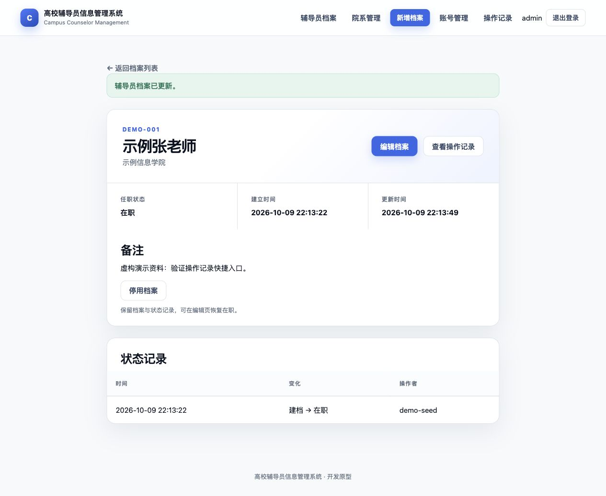

# 操作记录快捷入口验收

日期：2026-10-09。基于 `83bf6f8`，分支 `codex/audit-shortcuts`。

管理员此前需要从详情网址复制编号，再手工选择对象类型。现在档案详情、账号列表、院系列表均提供“查看操作记录”，直接进入对应类型与编号的筛选结果。账号入口使用账号自身编号，关联档案仍有独立入口。

只预填对象条件，保留全部操作者、日期及结果。继续使用现有分页查询与管理员授权；不改变审计事件、表结构或备份契约。已删除对象仍可在全局操作记录中查询。

## 本地验证

- `./mvnw --batch-mode --no-transfer-progress verify`：121 项 Java 测试通过。
- `python3 -B -m unittest discover -s scripts/tests`：32 项通过。
- 新增 3 项集成测试：从实际渲染的链接查询；同编号不同类型不混查、账号不误用关联档案编号；成功／失败／拒绝结果均保留且查询不新增事件；无记录时保留对象筛选；只读无入口、直接访问 403、匿名跳转登录。
- 临时 H2 浏览器演示：保存虚构档案后点击入口，准确显示该档案的更新事件；账号入口显示其创建事件；院系入口显示空结果。只读账号看不到详情入口，复制管理员链接仍返回 403。
- 默认视口与 390 像素窄屏复核：详情按钮可换行，列表操作文字不拆字，账号表格保持横向滚动区域。

截图仅含临时环境中的虚构资料。审计仍不包含字段前后值或防篡改保证；本轮远程检查以对应 PR 的 CI 结果为准。
