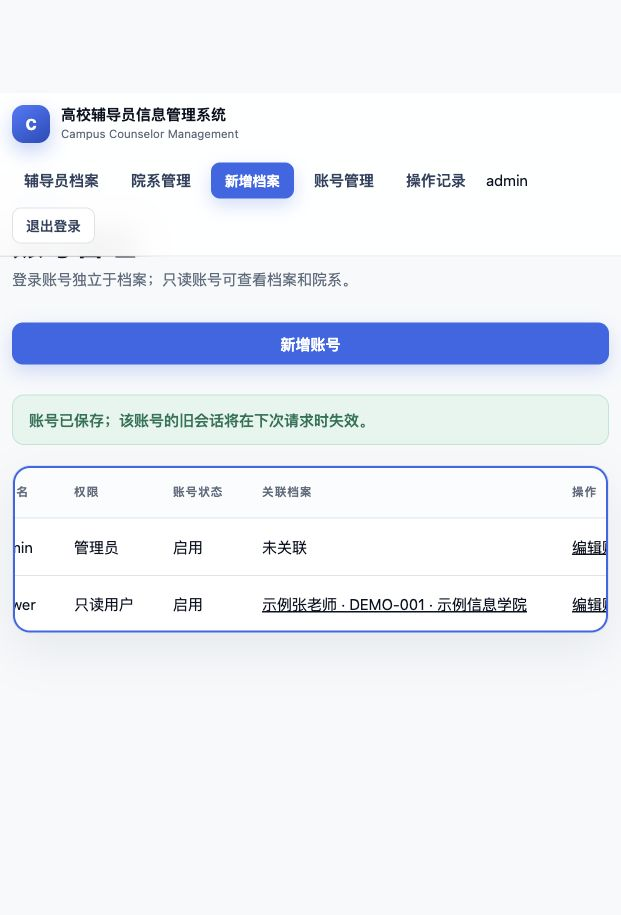

# 演示体验微调

日期：2026-10-04。基线 `2f13a83` 的[合并后 CI](https://github.com/GFLabandon/user-management/actions/runs/37207016108) 三项任务通过。本轮通过独立 H2 演示进程复核页面，只使用虚构资料。

## 发现与修改

- 只读用户查询无匹配档案时，原页面提示“或新增辅导员档案”，与权限不符。现在共同提示调整筛选，只有管理员看到新增指引；空院系列表也按角色提供下一步。
- 头像选择处原来仅说明格式和大小。现补充已有的 2048 像素边长、400 万总像素限制，并关联辅助说明，减少提交后才发现尺寸不符的情况。
- 账号保存成功原来使用普通边框。现统一使用绿色成功提示和 `role="status"`。
- 窄屏账号表格原来把权限和操作文字挤成多行。现保留 680 像素最小列宽，在表格区域横向滚动；账号、档案表格均可聚焦，提供滚动说明和可见焦点。

仅修改模板和 CSS，没有修改权限规则、业务写入、上传校验、数据库结构或备份格式。

## 验证

- `./mvnw --batch-mode --no-transfer-progress verify`：111 项测试通过，0 失败、0 错误、0 跳过；完成新 JAR 打包。
- `python3 -B -m unittest discover -s scripts/tests`：32 项通过。
- 浏览器重启后加载新构建：管理员与只读用户空结果提示正确；新增档案页显示完整头像限制；关联档案搜索、选择、保存及列表回显正常，成功提示为绿色。
- 当前窄屏视口中账号表格可视宽度 595 像素、内容宽度 680 像素；聚焦后按右方向键，实测 `scrollLeft` 从 0 增加到 17.5，页面表格内容可横向查看。
- 修改前还复核了档案编辑保存，以及操作记录错误日期返回可修改提示并保留条件。历史并发、权限和 MySQL 验收由现有测试与远程 CI 继续覆盖。

远程结果以本轮 PR 的完整 CI 为准。截图仅为本机演示证据，不代表真实用户数据或生产部署。

