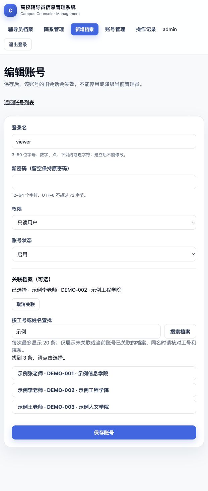

# 5A.1：账号关联档案选择

日期：2026-10-01。从 `7706eaa` 开始，分支 `codex/account-counselor-picker`。本次同步远程后确认没有分叉，保留上一轮方案文档并更新执行进度。此记录为本机验收，不代表远程 CI、合并或发布完成。

## 改动

账号表单不再要求手填档案 ID。管理员输入工号或姓名、点击搜索或按回车，候选展示姓名、工号和院系；点击选择，支持取消关联，编辑时回显当前关联。列表以一次 JOIN 查询展示可读档案信息及详情链接，不读取密码哈希或逐行查档案。

`GET /accounts/counselor-options` 沿用管理员权限，搜索词去首尾空白、限制 50 字符，空词返回空列表。查询使用参数绑定和字面子串匹配，按工号、ID 稳定排序，最多 20 条；超出时引导细化关键词。候选不包含其他账号已占用档案，编辑账号可看到自身关联；只返回 id、employeeNo、name、departmentName。

保存仍在账号管理锁内执行存在性、唯一关联和版本检查；新增明确的已占用提示，数据库唯一约束保留。并发选择不构成占用保证，最终以保存为准。页面失败保留选择与其他非敏感字段，不回填密码；JS 使用 textContent，丢弃过期搜索结果，并给出无结果、网络失败、登录过期和权限不足提示。

选择控件需要 JavaScript，禁用时显示说明并保留现有关联。没有新增依赖、迁移、索引、清理任务表或备份格式。

## 实际验收

| 检查 | 结果 |
| --- | --- |
| `./mvnw --batch-mode --no-transfer-progress verify` | 81 项，0 失败／错误／跳过；含新增 6 项账号选择测试 |
| Linux arm64 `docker build -t campus-counselor-management:local .` | 构建内同一组 81 项 Java 测试通过 |
| `python3 -B -m unittest discover -s scripts/tests -v` | 21 项通过 |
| `python3 -B scripts/verify-compose.py` | 11 组通过，新增账号选择组；既有容器运行、数据库故障恢复与持久化回归通过 |
| Codex 浏览器，本机 H2 演示 | 姓名搜索、工号搜索、回车不提交表单、无结果、选择、保存、列表回显、再次编辑及取消／更换选择通过 |

H2 新增测试覆盖同名、21 条数据限量、最小字段投影、字面通配符／SQL 注入样式输入、空词、过长词、无效账号、已占用过滤、编辑回显、失败保留、密码不回显、伪造 ID、重复关联、取消、过期版本、只读越权和 CSRF。

真实 MySQL 8.4.11 验收使用随机项目 `counselor-verify-f83d96adaae1` 和合成档案。两个独立管理员会话并发争用同一档案：一个保存成功，另一个收到“已关联其他账号”，数据库仅一条关联；随后验证伪造 ID 不修改数据、取消关联、旧版本不能恢复已取消关联、只读搜索拒绝及关联变化撤销旧会话。新增验证已进入原 CI 调用的运行验收脚本，不需要另建一套数据库测试环境。

应用镜像 ID：`sha256:c12ea2af3355425534ec830a783ad58dc2391aadd98c224600e97992db349bfb`。原始报告位于被忽略的 `target/surefire-reports/`、`target/compose-verification/counselor-verify-f83d96adaae1/result.json`；可长期保留的脱敏摘要见[JSON](phase-5a1-account-picker-result.json)。本次临时 MySQL 容器、卷、网络已清理，既有其他项目未启动或修改。

## 实际页面

下图为虚构 H2 演示数据，已保存关联后重新打开编辑页并搜索候选：

复现：启动 demo → 管理员登录 → 账号管理 → 编辑 viewer → 搜索“示例”或“DEMO-002” → 选择档案 → 保存 → 查看列表并重新打开编辑页。取消关联后需保存才生效。

## 边界与后续

4D.1 未发现新官方摘要，[安全发布阻断仍保留](../verification/security-mysql-review-2026-10-01.md)。本轮没有重新扫描镜像或执行远程 CI；真实 MySQL 迁移、协调备份恢复的专项结果沿用基线，数据库结构和维护脚本未修改。

下一批为 5A.2 通用错误与失败提示，之后为 5A.3 操作记录查询。账号列表仍沿用全量账号列表，候选仅限制返回量，不宣称大数据规模或高并发性能。
