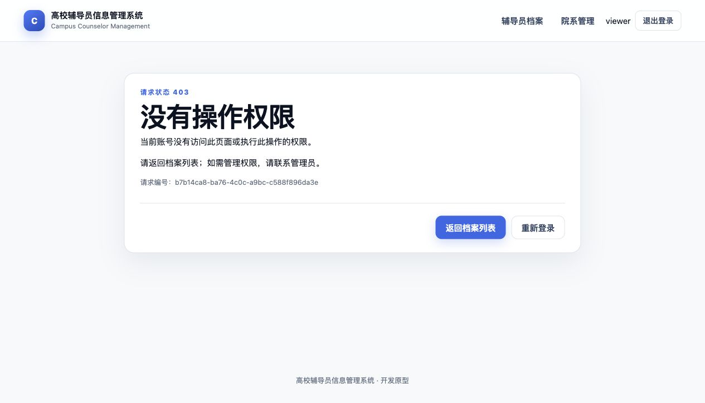
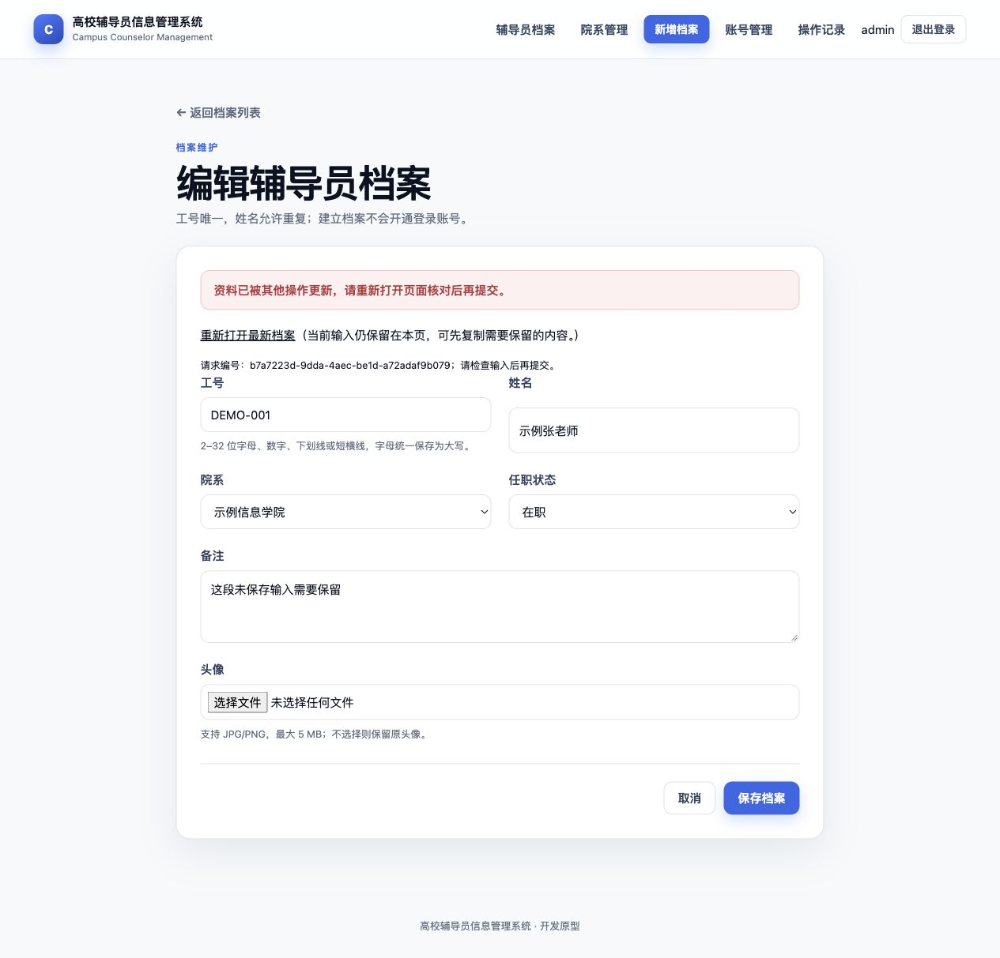

# 5A.2：错误与失败提示

日期：2026-10-01。基线 `e2f1689`，实施分支 `codex/error-feedback`，包含尚未合并的 5A.1。开始时同步远程，确认当前分支仅领先 `origin/main` 两个本地提交，没有分叉。

## 已完成

统一 MVC 异常与 Servlet ERROR 派发的中文页面，显示状态、原因、下一步、返回档案列表／重新登录入口，以及服务端生成的请求编号。过滤器拒绝请求也使用该页面；数据库异常后的错误派发跳过账号查库，避免错误页再次依赖故障数据库。直接访问 `/error` 返回 404，不采用查询参数中的状态或错误消息。

| 场景 | 状态与表现 |
| --- | --- |
| 缺参数、类型不正确、表单校验及业务约束 | 400；表单内失败保留可绑定的非敏感字段，通用参数错误不回显原始异常 |
| 记录不存在或已授权范围内的无效页面 | 404；提供返回入口 |
| 权限不足 | 403；说明当前账号无权限 |
| CSRF 缺失／无效 | 403；单独说明表单安全校验失效，提示重新打开表单或登录 |
| 编辑版本冲突 | 409；保留输入，提供最新记录链接，禁用旧表单保存按钮 |
| 唯一约束失败 | 409；返回表单并提示已占用；保存前识别到的业务占用沿用 400 |
| 上传超限 | 413；说明 5 MB／20 MB 限制和输入无法从未解析请求恢复 |
| 格式、图片内容和尺寸校验失败 | 400；显示受控中文提示，保留文字并提示重新选择图片 |
| 文件系统写入失败 | 500；表单显示安全提示，不展示底层 IOException 或绝对路径 |
| 数据库／服务暂不可用 | 503；提示稍后确认操作结果，并提供请求编号 |
| 未预期内部异常 | 500；不显示堆栈、SQL、路径、密码或会话内容，不承诺所有异常均发生在提交前 |
| 会话失效、账号停用或密码重置后旧会话访问 | 302 到登录页；统一说明失效原因范围和下一步，不泄露账号存在性 |

档案、账号、院系失败表单不再以 200 表示提交成功；停用／删除失败也保留原始失败状态，不再先重定向掩盖失败。密码不回填；账号表单补具体校验原因。既有管理员保护、CSRF、事务、唯一关联、版本和旧会话撤销机制保留。

默认拒绝的未授权路由仍为 403；本轮没有为了显示 404 放宽路由权限。健康探针保留原有无状态响应；图片资源不存在时仍返回空的 404。未增加 JSON 错误协议或新的业务接口。

## 真实上传补测与修复

真实 Tomcat 补测发现：20 MB 加 1 字节的上传生成了 413，但默认 2 MiB `maxSwallowSize` 导致连接关闭，客户端收不到完整响应。配置 `server.tomcat.max-swallow-size=21MB` 后，该边界用例完整收到中文 413 页面。

这是**有限的拒绝请求体清理上限**，不改变单文件 5 MB、总请求 20 MB 的接受限制，不使用无限制的 `-1`。更大的请求仍可能被关闭连接；不保证任意体积或连接中断时都能显示错误页。依据：[Tomcat HTTP Connector 的 maxSwallowSize](https://tomcat.apache.org/tomcat-11.0-doc/config/http.html)。

## 验收结果

| 检查 | 结果 |
| --- | --- |
| `./mvnw --batch-mode --no-transfer-progress verify` | 91 项 Java 测试通过，0 失败／错误／跳过 |
| Linux arm64 镜像构建内同一组测试 | 91 项通过，镜像构建成功 |
| `python3 -B -m unittest discover -s scripts/tests -v` | 21 项通过 |
| `python3 -B scripts/verify-compose.py` | 11 组真实 MySQL 运行验收通过；适配新状态码并新增 503 页面、请求编号和脱敏检查 |
| 浏览器实际操作 | 只读访问账号管理得到中文 403，返回列表可用；两份档案表单先后提交，后提交者看到冲突、保留文字、保存按钮禁用，重新打开链接显示先提交者内容 |

新增 10 项 Java 测试：4 项 MockMvc／业务状态检查，6 项真实随机端口 HTTP 测试。后者使用独立 H2 数据库和嵌入式 Tomcat，覆盖安全过滤器的 CSRF／角色拒绝、Controller 与过滤器抛出的 500／503、不存在页面、伪造 `/error` 参数、失效 Cookie、普通隐藏 CSRF 表单上传、请求头 CSRF 上传、单文件及总请求超限。模拟异常入口仅存在于测试源码，未打包进入应用。

其他验证包括：真实文件系统写入失败不暴露目录；拒绝的档案写入没有落库；过期账号停用／密码重置提交不覆盖最新版本；删除受引用院系或过期停用不修改业务数据。已有最少一个启用管理员、当前管理员保护、旧密码与旧会话失效测试继续通过。

MySQL 测试项目为 `counselor-verify-79c0432868ef`，仅使用随机隔离资源和合成数据。全部临时容器、卷和网络已清理，本次 H2 演示进程亦已停止。应用镜像为 `sha256:6b36eabecb893610a45e45604dc446bea9161845a5ea88b1b37da7a7c52628ee`。

脱敏结果摘要：[JSON](phase-5a2-error-feedback-result.json)。原始 Java 报告与 MySQL 报告分别位于被忽略的 `target/surefire-reports/` 和 `target/compose-verification/counselor-verify-79c0432868ef/result.json`。

## 实际页面

## 剩余边界

本轮未推送、合并或执行远程 CI；没有修改数据库结构、备份契约或依赖版本。迁移／协调备份恢复专项沿用基线证据，本轮重跑了真实 MySQL 运行与故障恢复验收。安全扫描未重跑，已有 MySQL 镜像发布阻断继续保留。

下一批为 **5A.3 操作记录中文说明、筛选及分页**；5B 文件清理重试和 6 性能测量尚未实施。
