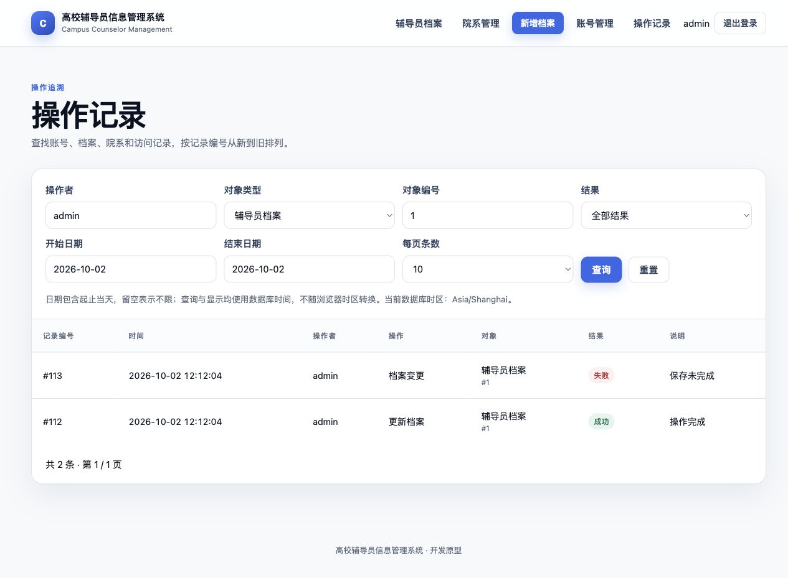
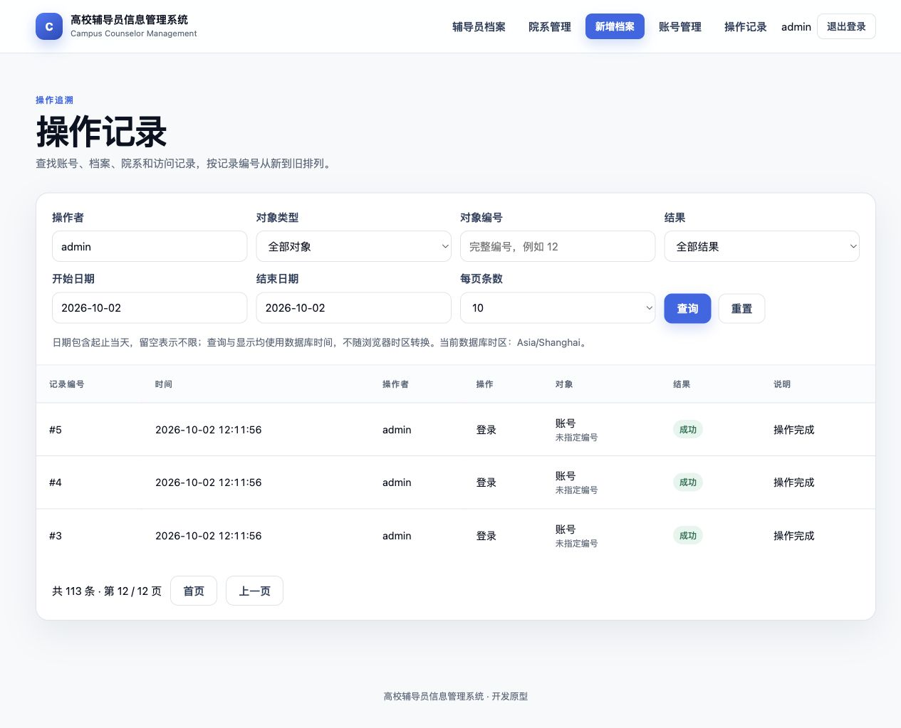

# 5A.3：操作记录查询

完成日期：2026-10-02。基线 `8f79615`，实施分支 `codex/audit-query`，包含尚未合并的 5A.1／5A.2。开始时同步远程，当前基线领先 `origin/main` 三个本地提交，没有分叉。

## 已完成

操作记录页面不再局限于最近 100 条，支持固定 ID 倒序分页、操作者、对象类型／编号、起止日期和结果组合筛选。动作、对象、结果和原因显示中文；映射只用于展示，不改写历史代码。未知代码显示“未知操作／未知对象／未知结果／原因未分类”，不直接展示未知原因内容；其他记录文本由 Thymeleaf 转义。

| 行为 | 约定 |
| --- | --- |
| 操作者 | 完整账号，不区分大小写，去首尾空格；不是模糊搜索 |
| 对象 | 可独立选账号／辅导员档案／院系／访问请求，或输入完整对象编号；编号为空表示不限，不等于筛选未指定编号 |
| 结果 | 成功、失败、已拒绝；空值为全部 |
| 日期 | `yyyy-MM-dd`，留空支持单边范围；包含起止当天，SQL 使用开始日 00:00（含）到结束日次日 00:00（不含） |
| 时区 | 与本次数据库会话一致，页面实际查询并显示时区；不换算浏览器时区，不修改已有时间或数据库会话设置 |
| 分页 | 默认 20 条，可选 10／20／50／100；首页、上一页、下一页、末页保留全部条件；重新查询回到首页 |
| 超出总页数 | 显示最后一页并提示；空结果保持第 1／1 页并提供清除筛选入口 |
| 非法参数 | 无效日期、反向范围、非法枚举、非整数页码、页码小于 1 或不支持的页大小返回 400；保留可绑定条件，不退回无条件查询 |
| 权限 | `/audit` 沿用 ADMIN 限制；VIEWER 为 403，匿名访问跳转登录 |
| 窄屏 | 筛选控件换行，表格保持可读列宽并在容器内横向滚动 |

对象编号来自历史事件，页面不强行连接当前业务表，因此已删除的院系或其他历史对象仍可查询。部分既有事件只记录一般的 `*_WRITE`／`SAVE_FAILED`，中文说明保留这个粒度，不推断“重置密码”等未被单独记录的动作。

## 查询与时间边界

计数与列表共用同一段绑定条件，所有值（包括 LIMIT／OFFSET）使用 MyBatis `#{}`，没有用户指定排序或 SQL 拼接。一次查询在只读 `REPEATABLE_READ` 事务中读取总数、页面和时区；在 MySQL 同一次请求内使用一致快照。跨请求翻页是实时查询，有新记录时页位置可能变化；不承诺跨页快照。

本机 H2 实测页面显示 `Asia/Shanghai`，默认 Compose MySQL 实测为 `SYSTEM / UTC`。H2 从 `INFORMATION_SCHEMA.SETTINGS` 读取会话设置；MySQL 使用 `@@session.time_zone`，为 `SYSTEM` 时同时显示 `@@system_time_zone`。MySQL 的 TIMESTAMP 按会话时区读取，H2 的无时区历史时间不会被自动纠正；已有库若曾改变时间约定，应先核对历史数据，不能把页面标签当作历史换算证明。依据：[MySQL 8.4 时区说明](https://dev.mysql.com/doc/refman/8.4/en/time-zone-support.html)、[H2 系统表](https://h2database.com/html/systemtables.html)、[H2 时间类型](https://h2database.com/html/datatypes.html)。

没有新增索引、表、批量导出、归档或统计页面；V1–V4、11 张表与备份恢复契约未变。未测量大数据量延迟或深分页性能，不据此宣称高并发能力。

## 验收结果

| 检查 | 结果 |
| --- | --- |
| `./mvnw --batch-mode --no-transfer-progress verify` | 99 项 Java 测试，0 失败／错误／跳过 |
| 最终 Linux arm64 镜像构建内测试 | 同一组 99 项通过，构建成功 |
| `python3 -B -m unittest discover -s scripts/tests -v` | 21 项通过 |
| `python3 -B scripts/verify-compose.py` | 最终镜像的 12 组真实 MySQL 运行验收全部通过 |
| 浏览器 | 完整组合筛选、113 条操作者记录的第 12 页、翻页保留条件、反向日期提示与条件保留、空结果和重置均验证；桌面和窄屏布局检查 |

新增 8 项 Java 测试：105 条固定时间记录按 ID 分页且可查到最早事件；组合筛选与日期首尾（含微秒尾部）；独立条件及单边日期；空结果；日期／枚举／页码／条数错误；SQL 符号按字面查询且不能改排序；未知代码与 HTML 转义；匿名及只读角色隔离。对比读取前后的原始事件，确认查询不改写记录。

MySQL 脚本新增 1 组审计查询验收，覆盖 105 条分页、页码越界、所有条件组合、日期两端、字面值／注入样例、非法输入、未知代码、只读和匿名拒绝。原有账号关联并发、CSRF、会话撤销、数据库停止／恢复、应用重建和卷持久化继续通过。

最终应用镜像：`sha256:288b4ed077db8399254ea584ef897dd3cae772665ef7d29eb3511f8aad132998`。最终 MySQL 项目：`counselor-verify-c876b9d5f3e8`。脱敏摘要见 [JSON](phase-5a3-audit-query-result.json)；原始报告在忽略目录 `target/surefire-reports/` 与 `target/compose-verification/counselor-verify-c876b9d5f3e8/`。

## 实测页面

5A 整体演示步骤与登录、档案检索、冲突和账号关联截图见[演示路径](../guides/phase-5a-demo.md)。全部截图仅含虚构数据。

## 收尾与剩余边界

验收使用随机隔离项目，临时容器、卷和网络在结束后清理；H2 演示只监听回环地址，完成截图后停止。没有修改既有数据库、上传卷或其他容器。

本轮未推送、合并或执行远程 CI。迁移／协调备份恢复专项沿用基线证据；未更新依赖或上游镜像摘要，未重跑漏洞扫描，已有 MySQL 镜像发布阻断继续保留。

5A.1–5A.3 已完成本机验收。下一批为 **5B 图片失败场景与清理可靠性**；6 性能测量和 Actions 运行时升级仍待实施。
