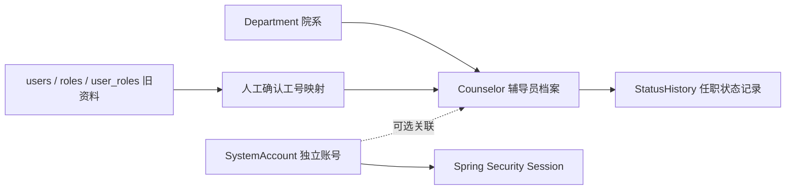

# 辅导员档案迁移与恢复

日期：2026-09-06。本说明针对第一阶段 `a916d1d` 的四张旧表，其他数据库结构需要先单独比对。

## 模型边界



档案不是登录账号；旧角色不自动转为账号权限。旧姓名允许原样复制，但不得据此生成真实工号。旧资料没有创建时间和任职状态：迁移记录以迁移时间记载，初始状态设为在职，操作者标识为 `legacy-migration`。正式数据迁移前需人工确认这一默认状态是否适用。

## 版本与初始化机制

| 版本 | 操作 |
| --- | --- |
| V1 | 建立原版 departments、roles、users、user_roles；仅供空库完整迁移 |
| V2 | 为院系新增 active、version；创建 counselors、状态记录和工号映射表 |
| V3 | 检查所有旧资料都有合法且唯一的大写工号，再复制旧资料并写入建档记录 |
| V4 | 创建独立账号、管理锁和操作记录表；不转换旧角色、不在迁移 SQL 中写入密码 |
| demo repeatable | 仅 demo 配置创建带 DEMO 工号的虚构资料 |

`spring.sql.init.mode=never`，Flyway 是唯一运行时结构初始化入口。`spring.flyway.baseline-on-migrate=false`，不会自动接管未知非空数据库；`clean-disabled=true`。MySQL 配置不加载 demo 数据。旧 SQL 位于 `docs/legacy/`，供比对与演练，不会自动执行。

## 空库

按 README 提供 MySQL 连接和首次管理员初始化变量，启动后完成 V1–V4；没有演示资料。账号初始化只在 Web 应用启动且账号库为空时执行，数据库仅存密码哈希。成功后移除初始化凭据，已有账号不会被重置。

已经使用 V3 的第二阶段数据库：先备份数据库和上传目录，再在副本运行 V4。档案表和旧表不改写；首次 Web 启动需初始化管理员。以下 `web-application-type=none` 命令仅执行迁移，不建立账号。

## 旧库迁移副本

1. 暂停旧应用写入，备份数据库和实际 `UPLOAD_DIR`，记录旧应用提交、备份时间、行数与文件清单。将备份恢复到新的数据库和上传目录中，仅对副本继续操作。
2. 比对副本的表结构与 `docs/legacy/mysql/schema.sql`。确认仅包含预期旧表和数据，外键、类型、编码、索引一致；不要为跳过错误而直接打开自动 baseline。
3. 将 `DB_URL`、数据库账号及 `UPLOAD_DIR` 指向副本，显式接管旧版结构为 V1，仅迁移至 V2：

```bash
java -jar target/campus-counselor-management-0.1.0-SNAPSHOT.jar \
  --spring.profiles.active=mysql \
  --spring.main.web-application-type=none \
  --spring.flyway.baseline-on-migrate=true \
  --spring.flyway.baseline-version=1 \
  --spring.flyway.target=2
```

4. 导出待映射清单并逐条确认工号。映射表限制一人一个工号且工号唯一；V3 另检查 2–32 位、大写字母／数字／下划线／短横线、首位字母或数字。不要把旧 username 当成工号，也不要把系统账号填进此表。

```sql
SELECT u.id, u.username, u.dept_id, u.photo_path, m.employee_no
FROM users u
LEFT JOIN legacy_counselor_mapping m ON m.legacy_user_id = u.id
ORDER BY u.id;

-- 仅是本仓库虚构旧样例的演练映射，不用于真实人员。
INSERT INTO legacy_counselor_mapping (legacy_user_id, employee_no) VALUES
    (1, 'DEMO-LEGACY-001'),
    (2, 'DEMO-LEGACY-002'),
    (3, 'DEMO-LEGACY-003');
```

5. 核对所有旧记录均已映射。保存 V2 数据库及上传目录备份，再运行完整迁移，移除临时 baseline 和 target 参数：

```bash
java -jar target/campus-counselor-management-0.1.0-SNAPSHOT.jar \
  --spring.profiles.active=mysql \
  --spring.main.web-application-type=none
```

6. 对比迁移前后行数、ID、姓名、院系、照片路径、备注；检查状态历史、头像读取和新建档案自增 ID。按 README 提供首次管理员凭据启动应用，验证编辑、分页、停用、版本冲突和重启持久化。完成核对后才考虑切换正式连接。

```sql
SELECT COUNT(*) AS legacy_count FROM users;
SELECT COUNT(*) AS copied_count FROM counselors;
SELECT u.id, u.username, c.name, u.dept_id, c.department_id,
       u.photo_path AS old_photo, c.photo_path AS new_photo, c.employee_no
FROM users u LEFT JOIN counselors c ON c.id = u.id ORDER BY u.id;
SELECT * FROM counselor_status_history ORDER BY id;
```

已有非样例真实资料时，映射内容必须由实际数据负责人提供。代码只验证映射格式与唯一性，不验证工号业务真实性，也不会从姓名猜测工号。

## 失败和回退

V3 对缺失或不合法映射先整体检查，再写入档案，避免前几条成功、后几条因映射缺失才失败。但 MySQL 的结构变更不能依靠事务完整撤回，迁移失败后不能只切换 Git 分支。

- 立即停止使用失败副本，不要让应用继续写入。
- 在新的空库恢复对应的数据库备份，并恢复同一时点的上传目录。
- 对照备份行数、外键关系和文件清单核对，再使用与该备份相匹配的旧应用版本启动。
- 补齐问题后从完整副本重新演练。不要盲目使用 Flyway repair、手动删除失败记录或修改已执行迁移的校验和。

旧 users/roles/user_roles 保留作迁移核对，并不等于完整回退备份。后续编辑头像会清理被替换文件，必须同时保留独立上传目录备份。未引用院系可删除；被档案或旧 users 引用的院系只能停用。

已在独立 MySQL 9.0.1 上演练缺失映射拒绝、恢复 V2 副本后继续迁移、恢复迁移前旧表与上传目录。结果见[验收记录](../acceptance/phase-2-counselor-records.md)。

## 技术依据

Spring Boot 建议由一种机制管理结构初始化，并支持按配置选择 Flyway 位置、Java 迁移以及 MySQL 专用模块。见 [Spring Boot 3.5 数据初始化说明](https://docs.spring.io/spring-boot/3.5/how-to/data-initialization.html)。该链接对应 2026-09-06 的历史版本。当前为 Boot 4.0.8 / Flyway 11.14.1；4D 使用打包依赖在独立 MySQL 8.4.11 中复验，结果见 [4D 验收](../acceptance/phase-4d-ci-release.md)。V1–V4 保持不变。
